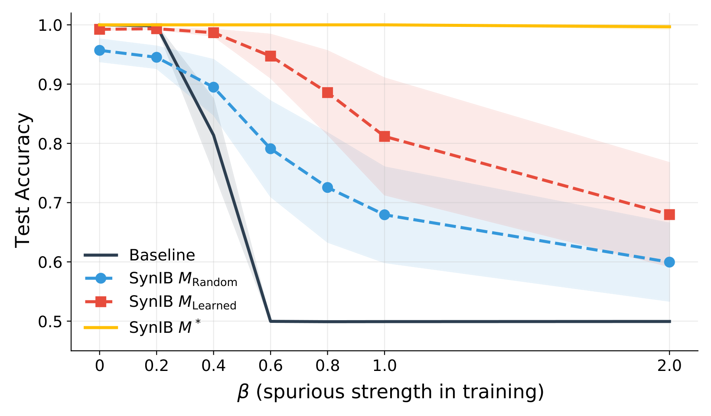
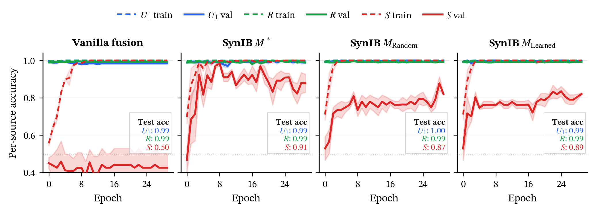
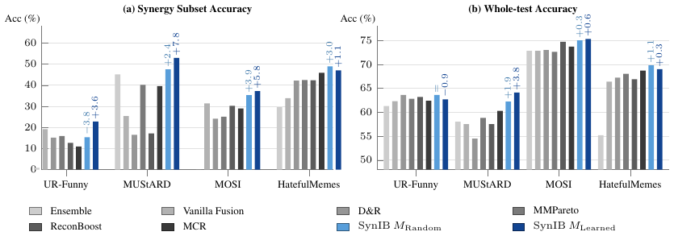
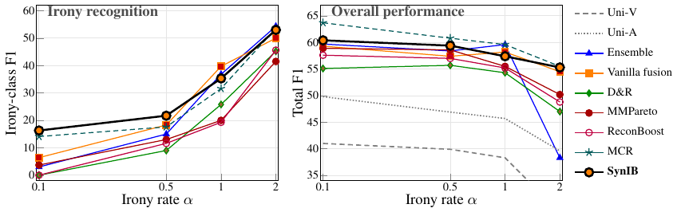

<h1 align="center">SynIB: Informational Bottleneck for Maximizing Synergy in Multimodal Learning</h1>

<p align="center">
  Konstantinos Kontras<sup>1,2</sup> · Teodora Gagaleska<sup>1</sup> · Thomas Strypsteen<sup>1</sup> · Christos Chatzichristos<sup>1</sup> · Matthew Blaschko<sup>1</sup> · Maarten De Vos<sup>1,†</sup> · Paul Pu Liang<sup>2,†</sup>
</p>

<p align="center">
  <sup>1</sup> KU Leuven &nbsp;·&nbsp; <sup>2</sup> MIT &nbsp;·&nbsp; <sup>†</sup> Equal supervision &nbsp;·&nbsp; Correspondence: <code>kkontras@mit.edu</code>
</p>

<p align="center">
  <a href="https://arxiv.org/abs/2606.09853"></a>
</p>

Code for our paper, [*SynIB: Informational Bottleneck for Maximizing Synergy in
Multimodal Learning*](https://arxiv.org/abs/2606.09853) (a local copy lives in
[`docs/paper.pdf`](docs/paper.pdf)).

Multimodal models tend to score well on average while quietly leaning on whichever
single modality is easiest to fit, and then they fall apart on the examples that
actually need both. SynIB is a training objective that goes after that gap directly.
The idea is simple: during training we run a few extra forward passes with one
modality feature-masked, and we penalize the model whenever it stays confident under
that corruption. Confidence that survives masking is a tell-tale sign the prediction
came from a unimodal shortcut, so penalizing it nudges the model toward genuinely
cross-modal (synergistic) reasoning.

Because it all happens at the loss level, SynIB drops in on top of an existing fusion
model without touching the architecture.

## The objective

With two modalities encoded into latents `(Z₁, Z₂)` and a fusion model `f`, we train

```
L  =  E[ −log q_θ(y | x₁, x₂) ]                       # cross-entropy on the intact pair
   +  λ · E[ D_KL( q_θ(· | x̃₁, x₂) ‖ r(·) ) ]          # confidence penalty under masking
```

where `x̃₁` is modality 1 with its task-relevant features masked out. We provide two
ways to build that mask:

* `M_random` masks coordinates independently (`Mᵢ ~ Bernoulli(π)`) and needs no extra
  parameters.
* `M_learned` trains a small adversarial mask to find the features a unimodal head
  relies on, and SynIB then corrupts everything else.

The whole method is in one file, [`src/synib/models/vlm/synib_mask_model.py`](src/synib/models/vlm/synib_mask_model.py):
`SynIB` plus the wrappers `FusionIBModel_Mask` and its asymmetric variant
`FusionIBModel_Mask_U`. The full derivation (the MIPD lower bound, the variational
surrogate, the mask construction) is in the paper.

## What's in here

We evaluate on five real benchmarks and a set of controlled synthetic tasks:

* **CMU-MOSI** (sentiment), **UR-Funny** (humor) and **MUStARD** (sarcasm) from
  MultiBench, using frozen MultiBench (V+T) features.
* **Hateful Memes**, with frozen CLIP-ViT-B/16 image features and DeBERTa-v3-base text
  features feeding a small fusion Transformer.
* **CREMA-D**, plus the **CREMA-D-Irony** extension we introduce, where the audio is
  swapped for a contradicting emotion to create controllable audio/visual synergy.
* **Synthetic XOR / PID** tasks (generated in code) that we use to study *why* synergy
  is hard to learn.

Every baseline (vanilla fusion, late ensembling, D&R, MMPareto, ReconBoost, MCR) shares
the same backbone and differs only in the training objective, so comparisons are
apples-to-apples. Baselines are picked through the per-dataset method configs, e.g.
`run/configs/hateful_memes/methods/`.

<p align="center">
  
  &nbsp;&nbsp;
  
</p>

On the synthetic XOR probes: as a unimodal shortcut strengthens, vanilla fusion collapses
to chance while SynIB stays robust (left); and on the synergy split, vanilla's validation
accuracy stalls even as training accuracy climbs — the memorization signature SynIB closes
(right).

## Results

On the **synergy subset** (test examples every unimodal model gets wrong) SynIB improves
over the strongest baseline on all four MultiBench/HM benchmarks — up to **+7.8%** on
MUStARD — while staying within ~1 point on the full test set:

<p align="center">
  
</p>

On the controllable **CREMA-D-Irony** task, SynIB beats the strongest baseline on irony-class
F1 at every irony rate α, with only minor trade-offs in overall F1:

<p align="center">
  
</p>

Full per-cell numbers and the synthetic-task sweeps are in [the paper](docs/paper.pdf).

## Install

```bash
pip install -r requirements.txt
```

You'll want a CUDA GPU; the code is tested on PyTorch 2.x. Run everything from the repo
root. The config files use `./data/...` as a placeholder for dataset and checkpoint
roots, so point those at wherever your data actually lives (edit the
`default_config_*.json` for each dataset, or just drop your data under `./data/`).

## A quick taste

The SynIB objective in ~20 lines of plain PyTorch — no repo install, just `torch`.
This is a minimal illustration of the idea (the real, batched implementation with the
learned mask lives in `src/synib/models/vlm/synib_mask_model.py`):

```python
import torch
import torch.nn as nn
import torch.nn.functional as F

torch.manual_seed(0)
B, d, n_classes, lam = 8, 16, 2, 0.1

# Stand-in "frozen features" from two modalities, plus labels.
z1 = torch.randn(B, d)                      # e.g. image features
z2 = torch.randn(B, d)                      # e.g. text features
y  = torch.randint(0, n_classes, (B,))

fuse = nn.Linear(2 * d, n_classes)          # any fusion model works here
uniform = torch.full((n_classes,), 1.0 / n_classes)   # reference distribution r(.)

def predict(a, b):
    return fuse(torch.cat([a, b], dim=-1))

# 1) standard task loss on the intact pair
ce = F.cross_entropy(predict(z1, z2), y)

# 2) SynIB term: mask modality-1's features, then PENALIZE confidence that survives.
mask = (torch.rand_like(z1) > 0.5).float()  # M_random ~ Bernoulli(0.5)
logits_cf = predict(mask * z1, z2)          # counterfactual: z1 corrupted, z2 intact
q  = F.softmax(logits_cf, dim=-1)
kl = (q * (q.log() - uniform.log())).sum(-1).mean()    # D_KL(q || uniform)

loss = ce + lam * kl                        # staying confident under masking is punished
loss.backward()
print(f"ce={ce.item():.3f}  kl={kl.item():.3f}  loss={loss.item():.3f}")
```

If the model can still predict confidently when a modality is masked, it was relying on
a unimodal shortcut, and the `kl` term pushes back. Setting `lam = 0` recovers plain
fusion training. In the repo this is generalized to symmetric/asymmetric variants, the
learned mask `M_learned`, and a learned reference — see the
[code map](docs/WHERE_IS_WHAT.md).

## Reproducing the paper

**👉 [`docs/REPRODUCE.md`](docs/REPRODUCE.md) lists the exact `python -m synib.entrypoints.train`
command (with every argument) for every cell in the paper** — SynIB, all baselines, and
the unimodals, across all five benchmarks plus the synthetic XOR tasks.

Each dataset also has a thin launcher under `run/` that wraps the `synib.entrypoints.train`
CLI and sets `PYTHONPATH` for you. The reported numbers are in the paper; the exact
per-cell commands and hyperparameters are in [`docs/REPRODUCE.md`](docs/REPRODUCE.md). A few
representative commands:

**MOSI / UR-Funny / MUStARD** (frozen MultiBench V+T features):

```bash
./run/multibench/download_and_build_cache.sh urfunny      # also: mosi | mustard

# SynIB with the random mask, fold 0
./run/multibench/train.sh urfunny-vt \
    run/configs/multibench/urfunny/synib.json \
    --fold 0 --rmask random --l 0.001 --perturb_pmin 0.7 --perturb_fill ema

# the vanilla baseline is just the same config with l = 0
./run/multibench/train.sh urfunny-vt \
    run/configs/multibench/urfunny/synib.json --fold 0 --l 0
```

**Hateful Memes** (CLIP-ViT + DeBERTa):

```bash
./run/hateful_memes/build_cache.sh
./run/hateful_memes/train.sh run/configs/hateful_memes/tiers/small_tf_deberta.json \
                  run/configs/hateful_memes/methods/synib.json --fold 0
```

The tier used in the paper is `small_tf_deberta`; the method overlays
(`vanilla`, `synib`, `synib_u`, `dnr`, `mmpareto`, `reconboost`, `mcr`, `uni_text`,
`uni_image`) live in `run/configs/hateful_memes/methods/`.

**CREMA-D / CREMA-D-Irony**:

```bash
./run/cremad/train.sh --rmask random --l 1.0 --pmin 0.20 --fold 0
./run/cremad/show.sh  --rmask random --l 1.0 --pmin 0.20 --fold 0
```

**Synthetic XOR** (the mechanism figures):

```bash
python scripts/analysis/xor_spurious_pub.py          # spurious-shortcut XOR
python scripts/analysis/figs_pid_ntk_dynamics.py     # PID / NTK training dynamics
```

## Finding your way around

```text
src/synib/
  models/vlm/synib_mask_model.py    the SynIB objective (start here)
  baselines/masking_only.py         the masking-without-KL ablation
  models/crema_d/                   CREMA-D backbones and the baseline objectives
  models/vision_text/               CLIP / DeBERTa encoders and fusion adapters
  mydatasets/                       MOSI / UR-Funny / MUStARD, Hateful Memes, CREMA-D
  training/pipeline/                the trainer / validator / loader
  entrypoints/                      the train / show / CEU command-line tools
run/                                per-dataset launchers and all configs
scripts/analysis/                   the synthetic XOR / PID / NTK experiments
docs/REPRODUCE.md                   every training command for every paper cell
docs/paper.pdf                      the paper
```

If you're hunting for a specific piece of the method,
[`docs/WHERE_IS_WHAT.md`](docs/WHERE_IS_WHAT.md) is a more detailed map.

## Citation

If you find this useful, please cite:

```bibtex
@article{kontras2026synib,
  title   = {SynIB: Informational Bottleneck for Maximizing Synergy in Multimodal Learning},
  author  = {Kontras, Konstantinos and Gagaleska, Teodora and Strypsteen, Thomas and
             Chatzichristos, Christos and Blaschko, Matthew and De Vos, Maarten and
             Liang, Paul Pu},
  journal = {arXiv preprint arXiv:2606.09853},
  year    = {2026}
}
```

## License

MIT, see [`LICENSE`](LICENSE).
